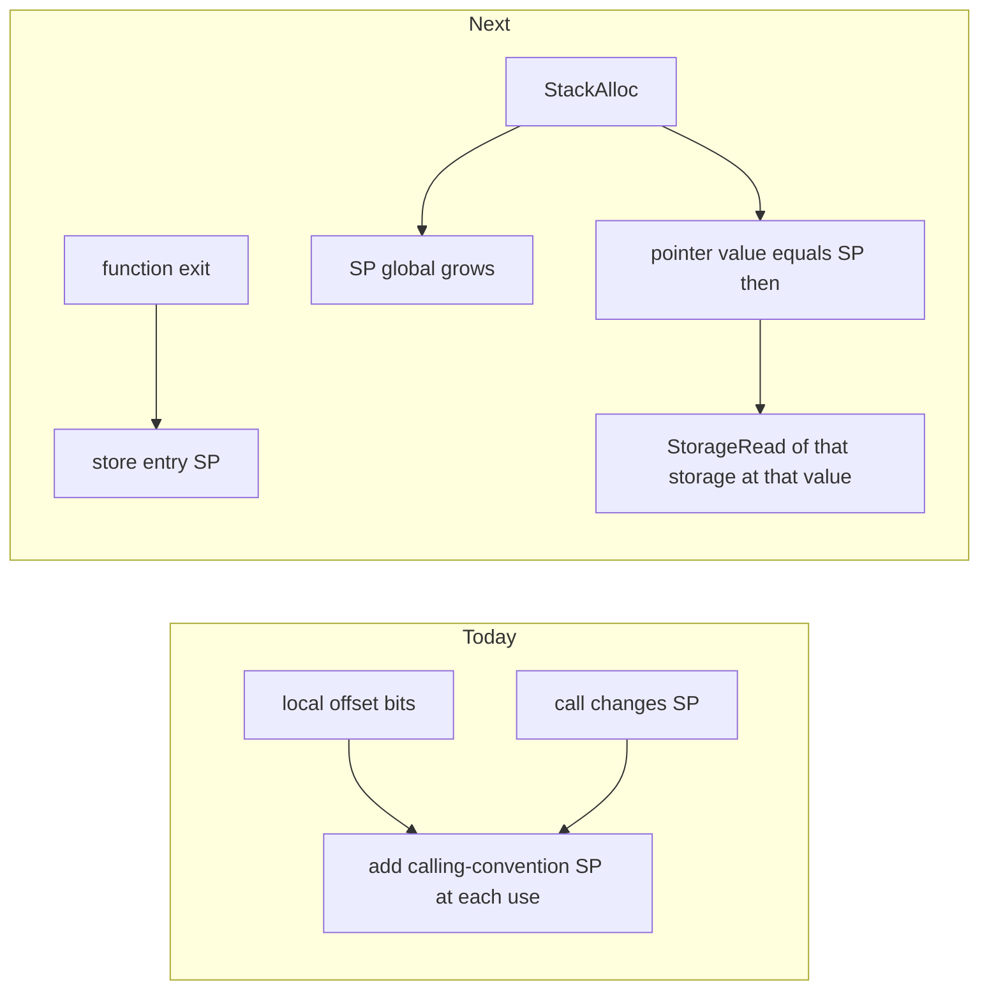

# Per-alloca stacks and extractable circuit helpers

## Why

`StorageId::ALLOCA` addresses are function-local offsets. [`rebase_stack_addr`](crates/ir/volar-vaffle-target/src/lower_to_ir.rs) adds the calling-convention stack pointer at every use, and a call changes that pointer with no store to the pointer value. The same bits name a different cell in the callee. `Value::StackAlloc` is only a size marker; LLVM import and `VaffleTarget::alloca` return a separate constant address and ignore the node’s result.

Circuit helpers in [`circuits.rs`](crates/ir/volar-lir/src/circuits.rs) are always spliced into the current block as `Stmt::Poly` bits. VAFFLE already has typed functions (`SigDecl`, entry `Value::Param`, `Terminator::Return`) and [`lower_to_ir`](crates/ir/volar-vaffle-target/src/lower_to_ir.rs) already accepts wide entry params, but neither VAFFLE producer emits them.

## 1. `StackAlloc` is the pointer

Change [`Value::StackAlloc`](crates/ir/vaffle/src/lib.rs) to:

- `storage: StorageId` — this site’s data stack, bit-addressed
- `sp: StorageId` — virtual stack-pointer global (one pointer-width cell at address 0)
- `elem_ty`, `count` — size in bits is `count * bit_width(elem_ty)`
- drop `base_slot`

Its result is the pointer: the SP value before the bump. [`lower_function`](crates/ir/volar-vaffle-target/src/lower_to_ir.rs) lowers that node, in statement order, to a read of `sp`, an add of the size, and a write of the new SP. No other storage id is rewritten.

Producers explode that result with `Shuffle` into pointer bits and use those bits as the address. `PtrLoad` / `PtrStore` / `PtrOffset` stay markers; the real memory ops are ordinary `StorageRead` / `StorageWrite` on `storage`. A custom allocator skips `StackAlloc` and emits its own SP traffic; those ops are copied through unchanged.

Delete `StorageId::ALLOCA`, `rebase_stack_addr`, `compute_alloca_budget`, and the call-site `advance` / post-call `retreat` of `alloca_budget` in [`lower_to_ir.rs`](crates/ir/volar-vaffle-target/src/lower_to_ir.rs). The calling-convention frame in `StorageId::STACK` stays as it is. [`inline_vaffle`](crates/ir/volar-ir-opt/src/inline_vaffle.rs) stops shifting `base_slot`; each site already has its own storage and SP global, and the entry-save / exit-restore stores travel with the body when a `Return` becomes a continuation jump.

## 2. LLVM import grows and reverts that stack

In [`volar-llvm-vaffle-import`](crates/frontends/volar-llvm-vaffle-import/src/lib.rs), each static `alloca` gets one data `StorageId` and one SP `StorageId` from the existing global allocator (base 64, so it never collides with `STACK`). `pre_init` writes 0 into the SP cell.

At the alloca: emit `StackAlloc` and use its result bits as the instruction’s pointer. Known-provenance loads, stores, GEPs, and memory intrinsics address `storage` at that pointer plus the element offset. They do not rebuild a constant local offset.

At the start of the function entry block, read each SP this function bumps. On every `Terminator::Return` and `Terminator::ReturnCall`, write those saved values back before leaving. The saved SSA values are function-scoped, so `vaffle_ssa` spills them to other blocks. A recursive call bumps the same global; the callee restores the SP it saw on entry, so the caller’s captured pointer still names its cell. A tail call restores before the jump so the bump does not leak.

Pointer values that escape (parameters, phi, select, dispatch) keep a provenance tag, but the stack case carries this site’s `StorageId` and the absolute bit offset from `StackAlloc`. Dispatch uses that id and offset as-is. It does not add the calling-convention SP.

`VaffleTarget::alloca` ([`target.rs`](crates/ir/volar-vaffle-target/src/target.rs)) follows the same contract: one storage and one SP global per `alloca`, the returned `VaffleValue` is the `StackAlloc` result, and `ret` / tail calls restore entry SPs. Absolute `StorageId::STACK` slot numbers go away for this path, so they no longer alias the call frame or other activations.

Constant-size integer, pointer, and array allocas stay the supported set. Symbolic counts stay fail-closed.

## 3. Circuit helpers can be functions

Add an explicit mode on both VAFFLE producers, default **inline** (today’s behavior):

- **Inline:** `VaffleTarget::{add,mul,…}` and LLVM `translate_instruction` keep calling `bc_*` on the parent block. Address math, SP bumps, and overflow-intrinsic fragments stay inline in both modes.
- **Extract:** the same outer ALU ops (`add`/`sub`/`mul`/`div`/`rem`/`shifts`/`icmp`/bitwise) intern one ordinary `FuncDecl::Body` per `(op, operand widths)`.

The shared intern lives in [`volar-vaffle-target`](crates/ir/volar-vaffle-target) (LLVM import gains that dependency; there is no crate cycle). The helper is not `funcs[0]`, so `vaffle_ssa` still threads its spill pointer. Its body is built with `bc_*` forced inline, so `bc_mul`’s internal `bc_add` stays in the helper instead of becoming another call.

Typed shape, which `lower_to_ir` already lowers:

- one entry param per operand, and one return value
- primitive `Type::_8`/`_16`/`_32`/`_64`/`_128` when the width matches, otherwise `IrType::Vec(n, Bit)`
- body explodes each param with `Shuffle`, runs the existing circuit, `Merge`s the result, and `Return`s that one value
- the parent `Merge`s operand bits, emits `Value::Call`, and projects result bits with `Value::Output` (bit index, as today)

Later passes (`inline_vaffle`, `lower_vaffle_to_ir`, movfuscate, virtualization) see a normal function. No helper-specific lowering.

## Tests and docs

Semantics stay the correctness check: evaluate across a call and a recursive call and require the stored alloca bytes to match, including after the callee returns. Also check that a second call reuses the low SP (exit restored it) and that a nested call does not permanently advance it.

Structural checks only where they are the invariant: lowered IR has no `ALLOCA` rebase and no `alloca_budget` adjustment; an extracted helper’s signature is one typed param per operand and one typed return; inline mode does not add that call.

Update the `StackAlloc` / `ALLOCA` comments and the alloca paragraph in [`docs/pipeline.md`](docs/pipeline.md) and [`docs/lir-abi.md`](docs/lir-abi.md). Rewrite `test_alloca_budget_reserved_across_nested_call` around the SP global. On acceptance, copy this plan to `docs/alloca-and-circuit-helpers-plan.md`.
