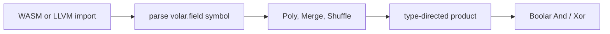

# Canonical extension fields

Accepted plan for `IrType::ExtField`. The sections below are the plan as accepted.


## Type

Add a payload variant on the hand-written `IrType` in [crates/ir/volar-ir-common/src/lib.rs](crates/ir/volar-ir-common/src/lib.rs), next to `Vec`:

```rust
ExtField {
    wrapped: TypeId,          // Bit, or another ExtField (a tower)
    degree: u32,              // >= 2
    irreducible: Vec<u64>,    // coeffs of degrees 0..=degree; monic
}
```

`wrapped` is the coefficient field. An element is a vector of `degree` coefficients of that field, laid out LSB-first in bit ranges `[i * w, (i + 1) * w)`, the same concatenation order `Merge` already uses for `IrType::Vec(degree, wrapped)`. Total width is `degree * width(wrapped)`.

`TypeTable::ext_field(...)` interns only after it checks: `wrapped` is `Bit` or `ExtField`, `degree >= 2`, `irreducible.len() == degree + 1`, the leading coefficient is 1, every coefficient fits in `wrapped`, and the polynomial is irreducible. Irreducibility is Rabin’s test, using this same field multiply (base case `Bit` is GF(2)). `Z3` is unchanged and is rejected as a coefficient field.

Canonical constructors, used everywhere the old tags were a semantic choice:

- `aes8()`: `ExtField(Bit, 8, [1, 1, 0, 1, 1, 0, 0, 0, 1])` — `x^8 + x^4 + x^3 + x + 1`.
- `galois64()`: `ExtField(Bit, 64, x^64 + x^4 + x^3 + x + 1)`. The old `Galois64` variant stored no polynomial; this primitive polynomial is the new canonical choice (reduction mask `0x1b`).

Remove `AES8` and `Galois64` from the schema unit enum and regenerate [crates/ir/volar-ir-common/src/generated.rs](crates/ir/volar-ir-common/src/generated.rs) with `volar-ir-schema-gen`. That shifts `Z3`’s rkyv discriminant; update the archive byte test in `volar-ir-common`. Every `PrimType::AES8` / `Galois64` match becomes `IrType::ExtField` or the canonical constructor (widths, movfuscate slots, LIR, text, fuzz, circuit-source).

Text form, parallel to `vec <len> <elem>`: `type i extfield <wrapped_id> <degree> <c0> … <c_degree>`. Writer sugar prints `aes8` or `galois64` when the payload matches a canonical constructor; the parser accepts that sugar and the general form.

## Operations

No new statement. Pack, unpack, addition, and multiplication stay on `Merge`, `Shuffle`, and `Poly`.

`Vec` already packs with `Merge` and unpacks with `Shuffle`. ExtField uses those the same way, because an element is the coefficient vector of its wrapped field:

- Pack: `Merge { parts: [c0, …, c_{degree-1}], ty: extfield }`, each part typed `wrapped`.
- Unpack coefficient `i`: `Shuffle` of bits `[i*w, (i+1)*w)` into a value of type `wrapped`. Bit indices stay `u8`, so a coefficient whose bit offset exceeds 255 fails closed. AES (8) and Galois64 (64) fit.

### Poly product, by output type

A `Poly` remains a sum of monomials. The `u8` coefficient stays a characteristic-2 repetition count (`coeff & 1` still cancels duplicates). It is not a field element. A non-trivial field scalar is a `Const` factor inside the monomial. The sum across monomials is XOR. The product inside one monomial is type-directed and recurses:

- **Bit.** Product is AND. Repeated factors collapse, because `a * a = a`. The empty product is 1.
- **Integer primitive** (`_8`, `_16`, …). Same as `Vec(width, Bit)`: map that bit product across lanes, and spread a 1-bit factor to every lane. This is today’s `lower_poly_bit` in [crates/ir/volar-ir-passes/src/lower_ir_to_boolar.rs](crates/ir/volar-ir-passes/src/lower_ir_to_boolar.rs).
- **`Vec(n, E)`.** Map: for each lane `i`, recurse at type `E`. A factor of type `Vec(n, E)` contributes lane `i`. A factor of type `E` or `Bit` spreads to every lane. A length mismatch fails closed.
- **`ExtField { wrapped, degree, irreducible }`.** Field-typed factors multiply by schoolbook polynomial multiplication modulo `irreducible`. Each coefficient product recurses at `wrapped` (`Bit` is AND; a tower is another field multiply). A `Bit` factor is a 0/1 selector. A `wrapped` factor embeds as the degree-0 coefficient, the same spread a scalar gets in a vector space. Repeated field factors stay, so `a * a` is the square. The empty product is the field one (`1`), not all-ones.

`Tuple`, `Block`, `Func`, and `Z3` as a `Poly` output fail closed.

The interpreter, `lower_ir_to_boolar`, and `lower_lir` share this recursion. Boolar emits hash-consed `And` / `Xor`. The bit and bitvector cases keep the current per-bit loop. `lower_lir` expands a field product to integer `and` / `xor` / `shl` and stores the value as an unsigned integer of the total width, so the C backend’s `AES8` `volar_gf8_mul` special case goes away with the primitive. The old “at most one non-bit factor per monomial” rule remains for bitvectors; an `ExtField` monomial may contain several field factors, and that product is the field multiply.



### Gate idempotent folds

`mul_is_idempotent(ty)` is true for `Bit`, integer primitives, and a `Vec` whose element is idempotent. It is false for `ExtField`. Folds that assume `a * a = a` or that all-ones is the multiplicative identity run only on idempotent types. Characteristic-2 cancellation stays everywhere.

- [`apply_aliases_to_stmt`](crates/ir/volar-ir-opt/src/common.rs) dedups a monomial key with no type context (`v*v = v`). Callers in [ir.rs](crates/ir/volar-ir-opt/src/ir.rs) and [substitute_ir.rs](crates/ir/volar-ir-opt/src/substitute_ir.rs) pass the type table and dedup only idempotent factors. The VAFFLE alias rewrite in [store_forward.rs](crates/ir/volar-ir-opt/src/store_forward.rs) does not dedup today and must not start.
- [`fold_poly_in_place`](crates/ir/volar-ir-opt/src/common.rs) currently returns immediately on a field output and copies field factors through unchanged. It should fold them under split rules:
  - Even coefficients still drop. Two copies of the same monomial still cancel by XOR.
  - A constant `0` still kills the monomial.
  - A constant factor is removed only when it is the multiplicative identity of that factor’s type: all-ones for an idempotent type, field `1` for `ExtField`. All-ones on a field element stays.
  - `dedup` runs only on idempotent factors. `[a, a]` for an extension element stays.
  - An empty monomial contributes the identity of the output type: all-ones for bits and bitvectors, `1` for an extension field.
  - A monomial whose factors are all constant evaluates with the real product, including a field square, and XORs into `constant`.
- [`merge_poly_into`](crates/ir/volar-ir-opt/src/common.rs) inlines only a singleton key `[x]`. That is linear over XOR, so it stays valid when `x` is an extension element. It must not dedup field factors in the copied monomials. The `key.len() == 1` checks in `vaffle.rs` and `ir.rs` stay. Inlining into a longer key such as `[x, y]` is not this optimization; that would have to distribute field multiplication.
- `PolyCoeffs::remap_monomials_in_place` overwrites the coefficient when two keys collide after a rewrite. Colliding keys combine with XOR and then drop zeros, matching the other poly rewrites, so two copies of one field product still cancel.

## Imported symbol

One name grammar, parsed in `volar-ir-common` (alloc only), shared by both frontends:

`volar.field.<op>.d<degree>.<wrapped>.p<hex>`

- `<op>` is `add`, `mul`, `pack`, or `unpack`.
- `<wrapped>` is `bit`, or `e` plus a nested `d<degree>.<wrapped>.p<hex>` for a tower.
- `<hex>` is the low `degree` coefficients (leading 1 omitted), little-endian, matching the C reduction mask. AES multiply is `volar.field.mul.d8.bit.p1b`.

Carriers: LLVM `i{width}`; WASM `i32` up to 32 bits, `i64` up to 64, otherwise little-endian `i64` limbs. `add` and `mul` take two packed carriers and return one. `pack` takes `degree` wrapped carriers. `unpack` takes the packed element and a constant index operand; a non-constant index fails closed.

Recognition, before the existing import-to-abort path:

- WASM: [crates/ir/volar-vaffle-target/src/waffle_lower.rs](crates/ir/volar-vaffle-target/src/waffle_lower.rs) `Operator::Call`, instead of `call_extern_multi`.
- LLVM structural: [crates/frontends/volar-llvm-vaffle-import/src/lib.rs](crates/frontends/volar-llvm-vaffle-import/src/lib.rs) `InstructionOpcode::Call`, instead of `FuncDecl::Import`.
- LLVM-direct: the empty `HostCallRegistry` in [crates/frontends/volar-llvm-ir-import/src/lib.rs](crates/frontends/volar-llvm-ir-import/src/lib.rs), emitting the same IR statements into the single block.

`volar-wasm-circuit-import` stays fail-closed on these names, with an error that names the symbol. That path emits a `VCircuit` and does not build a Volar IR type table.

Guest integers are bit vectors at the import boundary. The frontend `Transmute`s/`Merge`s those bits into `ExtField` values, emits `Poly` (a sum for `add`, a two-factor monomial for `mul`), `Merge`, or `Shuffle`, and projects the result back to the carrier width. Surrounding integer code stays bit-blasted.

## Tests and docs

Semantics preservation, not statement-shape asserts: evaluate the IR, lower to Boolar, evaluate Boolar, and compare. Cover the FIPS-197 product `{57} • {13} = {fe}` as a two-factor `Poly`, a Galois64 multiply against the interpreter, a pack then unpack that recovers each coefficient, and a `Vec` of `aes8` whose product maps per lane while a scalar factor spreads. Folding tests: a bit monomial `[a, a]` still becomes `[a]`; an `ExtField` monomial `[a, a]` stays and evaluates to the square; constant field `1` drops out of a product; constant all-ones does not. Retarget the existing AES8 movfuscate and `poly_aes8_linear_combo_xors_per_bit` fixtures at `aes8()`. Add a parser test for the symbol, plus one LLVM text module and one WASM import that call `volar.field.mul.d8.bit.p1b` and match that product.

Update [docs/agent-context/ir-types-storage.md](docs/agent-context/ir-types-storage.md) so the `Poly` rule is this type-directed product instead of “at most one non-bit factor,” plus [docs/ir-lowering.md](docs/ir-lowering.md), [docs/text-format-spec.md](docs/text-format-spec.md), and [docs/wasm-feature-support.md](docs/wasm-feature-support.md). After this plan is accepted, copy it to `docs/extfield-plan.md`.
